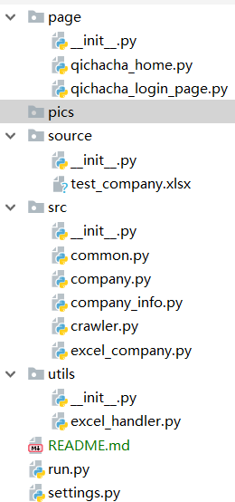

# Crawler

Crawler 是一个专门用来爬取企业信息的爬虫工具

# 目录结构

- data 存放抓取后保存数据的excel
- page 存放企查查的相关页面的PageObject
- source 存放需要抓取的企业信息excel
- src 存放爬取相关的文件
- utils 存放工具文件
- settings.py 工程的全局配置文件
- run.py 工程的路口

# 快速开始

1. 将需要爬取的企业信息放入到excel中,格式如下: \
      \
     第一行随便写，默认从第二行开始读取企业名称
2. 运行run.py \
      \
     > 程序会自动输入在settigs.py中配置的账号密码，但是需要手动到控制台输入验证码 \
     > __目前没有实现自动识别输入的功能，后续会更新__
3. 到控制台输入看到的验证码 \
      \
     验证错误次数默认最多为5，可以在settings.py中修改
4.

