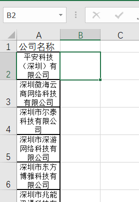
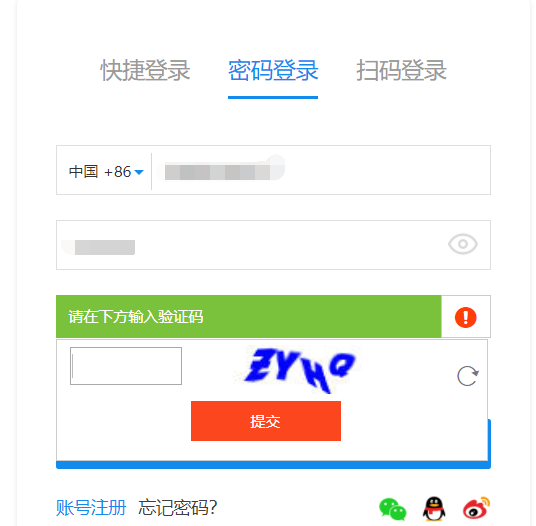
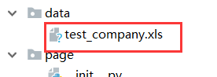
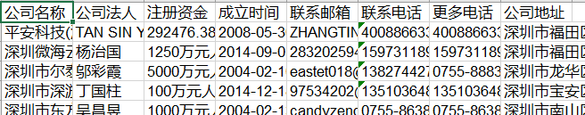

# Crawler
 \
Crawler 是一个专门用来爬取企查查企业信息的爬虫工具，你只需要提供一个拥有企业名称的excel

# 注意
- master代码已经失效，现已更新v2版本，请切换分支为[v2](https://github.com/robertzhangwenjie/qichacha_crawler/tree/v2)
- 目前已实现全自动爬取，无需人工干预，只需要提前注册好账号即可，采用新的框架scrapy完成，地址：[scrapy_example](https://github.com/robertzhangwenjie/scrapy_example)
# 目录结构

- data 存放抓取后保存数据的excel
- page 存放企查查的相关页面的PageObject
- source 存放需要抓取的企业信息excel
- src 存放爬取相关的文件
- utils 存放工具文件
- webdrivers 存放webdriver
- settings.py 工程的全局配置文件
- run.py 工程的路口

# src/*.py文件说明

- common
    >  判断元素是否存在 \
    >  下一步优化目标: 验证码自动识别功能

- company_basic_info
    >   获取需要爬取的企业的基本信息，如企业名称，企业信息表名(后续存数据时默认和企业信息表名相同)等

- company_excel
    >   企业信息对应的excel对象，主要用来初始化excel，保存数据等功能


- company_info
    >   获取企业信息list

- company_parser
    >   对企业信息html进行解析

- requests_executor
    >   requests请求执行器

- selenium_executor
    >   selenium请求执行器

- scrapy_engine
    >   爬虫引擎，包含request和selenium两种引擎，运行时可以选择其中一个，推荐使用requests，更快更稳定


# 快速开始

- 使用ScrapyerWithSelenium引擎爬取

1. 将需要爬取的企业信息放入到excel中,格式如下: \
      \
     > 第一行随便写，默认从第二行开始读取企业名称
2. 运行run.py \
      \
     > 程序会自动输入在settigs.py中配置的账号密码，但是需要手动到控制台输入验证码 \
     > __目前没有实现自动识别输入的功能，后续会更新__
3. 到控制台输入看到的验证码 \
      \
     > 验证错误次数默认最多为5，可以在settings.py中修改
4. 查看抓取企业信息 \
      \
     > 抓取后自动生成一个excel，名称与source文件夹下的修改时间最新的一致
     > 抓取后的结果如下

      \

- 使用ScrapyerWithRequests引擎爬取

1. 同上面的步骤一样，准备好企业信息的excel

2. 需要先手动登录，获取到登录后的cookies，然后直接运行
```python
if __name__ == '__main__':
    from src.scrapy_engine import ScrapyerWithRequests, ScrapyerWithSelenium
    cookies = 'acw_tc=7909f42815593172890043685e75a14e702b0dfcfec1e138924a4a756b; zg_did=%7B%22did%22%3A%20%2216b105fe733ab-0b47b45a8b01c8-3b604b0a-144000-16b105fe7344f9%22%7D; UM_distinctid=16b105fe75c25d-0ae12f98b15654-3b604b0a-144000-16b105fe75d93d; _uab_collina=155934785002814269355557; QCCSESSID=e1b226u9k9ep47jfps6i7vvb74; hasShow=1; Hm_lvt_3456bee468c83cc63fb5147f119f1075=1560263957,1560264137,1560560102,1560560219; acw_sc__v3=5d04bcda00cf6beca6cd9fd6642b76f954b5ed5a; acw_sc__v2=5d04bcdad4ce8f63da86d64e92374fb70e58a956; CNZZDATA1254842228=72162867-1559343956-%7C1560591556; Hm_lpvt_3456bee468c83cc63fb5147f119f1075=1560591891; zg_de1d1a35bfa24ce29bbf2c7eb17e6c4f=%7B%22sid%22%3A%201560591581997%2C%22updated%22%3A%201560591899520%2C%22info%22%3A%201560263956853%2C%22superProperty%22%3A%20%22%7B%7D%22%2C%22platform%22%3A%20%22%7B%7D%22%2C%22utm%22%3A%20%22%7B%7D%22%2C%22referrerDomain%22%3A%20%22%22%2C%22cuid%22%3A%20%22d07d0dce843c5c059aeee45c5acd4e27%22%7D'
    runner = ScrapyerWithRequests(cookies)
    runner.run()
```

